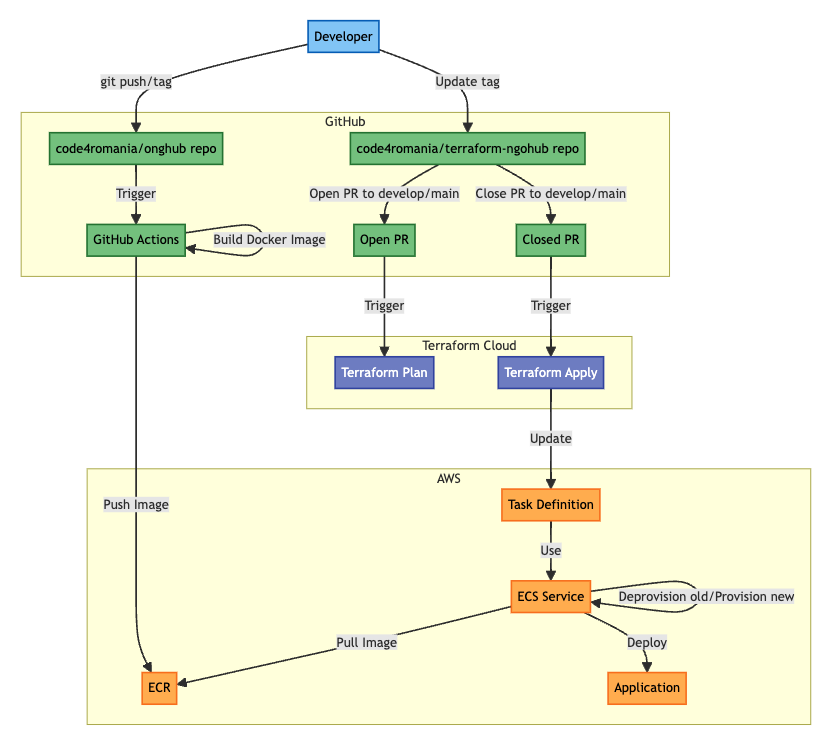

# NGO Hub

[![GitHub contributors][ico-contributors]][link-contributors]
[![GitHub last commit][ico-last-commit]][link-last-commit]
[![License: MPL 2.0][ico-license]][link-license]

Insert bullets description of the project if available.

[See the project live][link-production]

Give a short introduction of your project. Let this section explain the objectives or the motivation behind this project.

[Contributing](#contributing) | [Built with](#built-with) | [Repos and projects](#repos-and-projects) | [Deployment](#deployment) | [Feedback](#feedback) | [License](#license) | [About Code for Romania](#about-code-for-romania)

## Contributing

This project is built by amazing volunteers and you can be one of them! Here's a list of ways in [which you can contribute to this project][link-contributing]. If you want to make any change to this repository, please **make a fork first**.

Help us out by testing this project in the [staging environment][link-staging]. If you see something that doesn't quite work the way you expect it to, open an Issue. Make sure to describe what you _expect to happen_ and _what is actually happening_ in detail.

If you would like to suggest new functionality, open an Issue and mark it as a **[Feature request]**. Please be specific about why you think this functionality will be of use. If you can, please include some visual description of what you would like the UI to look like, if you are suggesting new UI elements.

## Built With

React / NestJS

### Programming languages

Javascript / Typescript

### Platforms

Web

### Frontend framework

React

### Package managers

NPM

### Database technology & provider

Postgres in AWS RDS

## Repos and projects

1. [terraform-ngohub](https://github.com/code4romania/terraform-ngohub)

## Deployment

The deployment process requires to understand the infrastructure orchestration.

1. There are 2 environments: [**staging**](https://app-staging.ngohub.ro/login) and [**production**](https://app.ngohub.ro/login)
2. FE deployed in AWS Amplify
3. BE deployed in AWS ECS
4. AWS Infrastructure managed by Terraform ([terraform-ngohub](https://github.com/code4romania/terraform-ngohub))




### Front-End Deployment

-   Deployed using AWS Amplify
-   AWS Amplify is connected with this repository
-   The build is automatically triggered when a commit is pushed to:
    -   Develop - build in **staging**
    -   Main - build in **production**

### Backend-End Deployment

The following are the involved parts:

1. Github Actions ([build-image.yml](https://github.com/code4romania/onghub/blob/main/.github/workflows/build-image.yml))
2. ECR where the Docker Images are stored
3. ECS container orechestrator (_aka where the Docker image is running/managed_)
4. Terraform project ([terraform-ngohub](https://github.com/code4romania/terraform-ngohub))
5. Terraform Cloud

When a new deployment is needed, there is a flow of events to understand:

1. A `git push` or `git tag` to the `develop / main` branch will trigger the Github Action (1) to:

    1. build the Docker Image
    2. tag the image (with the branch or the tag)
    3. push the image to ECR (2)

    > 🧠 Note: We want to **tag a commit** in order to have a tagged image in ECR to be picker later. Check the existing tags and use a new one (e.g. 0.1.5)

2. Once the Docker Image is available in ECR, we can instruct ECS to pick the new image to replace the current. We do this, by navigating to [locals.tf](https://github.com/code4romania/terraform-ngohub/blob/main/locals.tf) in the [terraform-ngohub](https://github.com/code4romania/terraform-ngohub) repository and update the backend `tag` with the new, fresh one.

    ```json
        backend = {
            domain = "api${local.env_suffix}.${var.root_domain}"
            image = {
                repo = data.aws_ecr_repository.ngohub_backend.repository_url
                tag  = "1.0.14" -> "1.0.15" // 👈 Update 1.0.14 to 1.0.15
            }
        }
    ```

    🧠 There are **2 important** triggers on the Terraform Repository (4) ran by Terraform Cloud(5):

    1. `terraform plan`
        1. PR to _develop_ - plan for `staging` environment
        2. PR to _main_ - plan for `production` environment
    2. `terraform apply`

        1. Close PR to _develop_ - apply changes in `staging`
        2. Close PR to _main_ - apply changes in `production`

        1️⃣ (1) will be visibile in the PR, and will display the infrastructure changes.  
         2️⃣ (2) will make the infrastructure changes as described in the plan.

    🏆 In the end, we want to apply the changes (close the PR) so a new ECS Task Definition will be created using the new image with the new `tag` we updated and the ECS Service will replace the old task definition with the new one, ensuring zero downtime deployment.

     <hr/>

    ❌ DO NOT try to push changes directly to develop/main. The branches are protected.

    ✅ Recommended steps:

    1. create a new branch from develop
    2. make changes in [locals.tf](https://github.com/code4romania/terraform-ngohub/blob/main/locals.tf) as described above
    3. commit changes
    4. open PR against develop
    5. check the `terraform plan` is working as expected
    6. close the PR
    7. test changes in the staging environment
    8. once you are sure everything is fine, repeat for the `main` branch to deploy into `production`.

## Feedback

-   Request a new feature on GitHub.
-   Vote for popular feature requests.
-   File a bug in GitHub Issues.
-   Email us with other feedback contact@code4.ro

## License

This project is licensed under the MPL 2.0 License - see the [LICENSE](LICENSE) file for details

## About Code for Romania

Started in 2016, Code for Romania is a civic tech NGO, official member of the Code for All network. We have a community of around 2.000 volunteers (developers, ux/ui, communications, data scientists, graphic designers, devops, it security and more) who work pro-bono for developing digital solutions to solve social problems. #techforsocialgood. If you want to learn more details about our projects [visit our site][link-code4] or if you want to talk to one of our staff members, please e-mail us at contact@code4.ro.

Last, but not least, we rely on donations to ensure the infrastructure, logistics and management of our community that is widely spread across 11 timezones, coding for social change to make Romania and the world a better place. If you want to support us, [you can do it here][link-donate].

[ico-contributors]: https://img.shields.io/github/contributors/code4romania/standard-repo-template.svg?style=for-the-badge
[ico-last-commit]: https://img.shields.io/github/last-commit/code4romania/standard-repo-template.svg?style=for-the-badge
[ico-license]: https://img.shields.io/badge/license-MPL%202.0-brightgreen.svg?style=for-the-badge
[link-contributors]: https://github.com/code4romania/standard-repo-template/graphs/contributors
[link-last-commit]: https://github.com/code4romania/standard-repo-template/commits/main
[link-license]: https://opensource.org/licenses/MPL-2.0
[link-contributing]: https://github.com/code4romania/.github/blob/main/CONTRIBUTING.md
[link-production]: insert_link_here
[link-staging]: insert_link_here
[link-code4]: https://www.code4.ro/en/
[link-donate]: https://code4.ro/en/donate/
